# Smart Kade 

**Smart Kade** is a modern online food ordering web application built with **React.js (Vite)**, **Node.js**, and **MongoDB (local)**. Users can browse and search the menu, filter by categories, view today’s offers, place orders, and download detailed bills. Admins can securely manage menu items by adding, updating, or deleting dishes.

---

## Table of Contents
- [Features](#features)
- [Tech Stack](#tech-stack)
- [Screenshots](#screenshots)
- [Demo Credentials](#demo-credentials)
- [Setup Instructions](#setup-instructions)
- [Author](#author)
- [License](#license)

---

## Features
- Browse the full menu with category filters and search functionality
- View today’s special offers
- User accounts: place orders and download detailed bills
- Admin panel: add, update, or delete menu items
- Responsive design for desktop and mobile

---

## Tech Stack
- **Frontend:** React.js (Vite)  
- **Backend:** Node.js with Express  
- **Database:** MongoDB (local)  
- **Authentication:** JWT-based secure login  
- **Styling:** CSS / Tailwind / React components  

---

## Screenshots

| Page | Screenshot |
|------|-----------|
| Home | 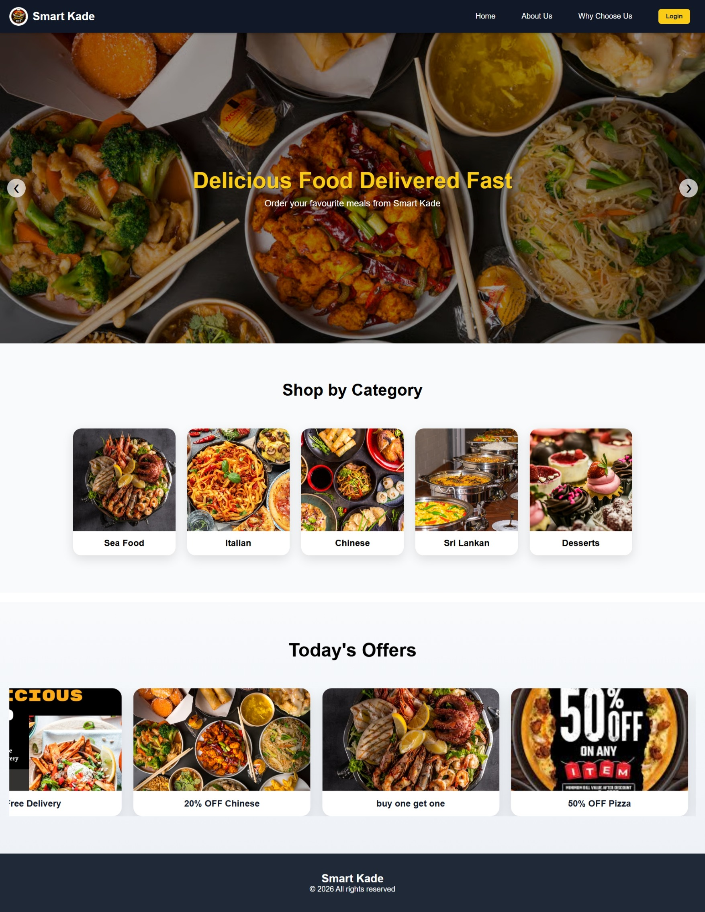 |
| About | 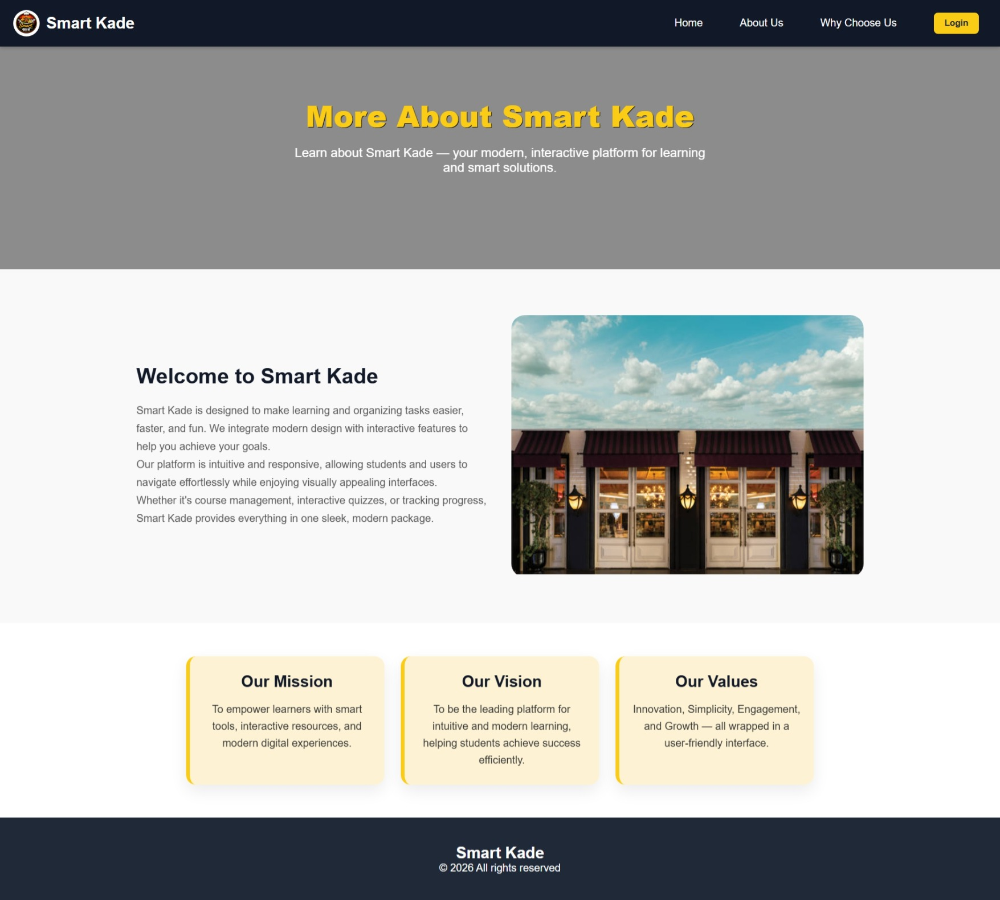 |
| Why Choose Us | 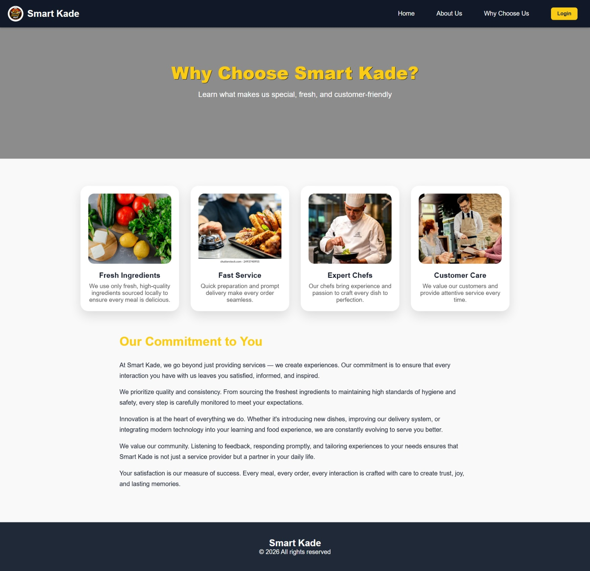 |
| Admin Login | 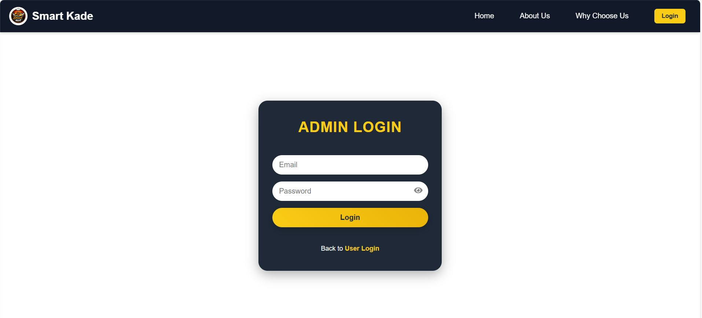 |
| User Login | 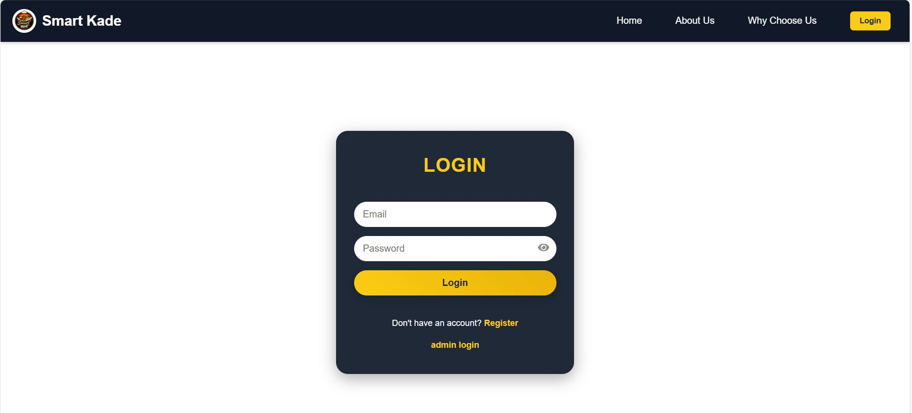 |
| Register | 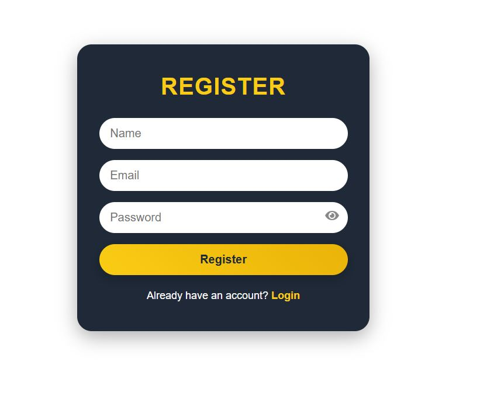 |
| Menu | 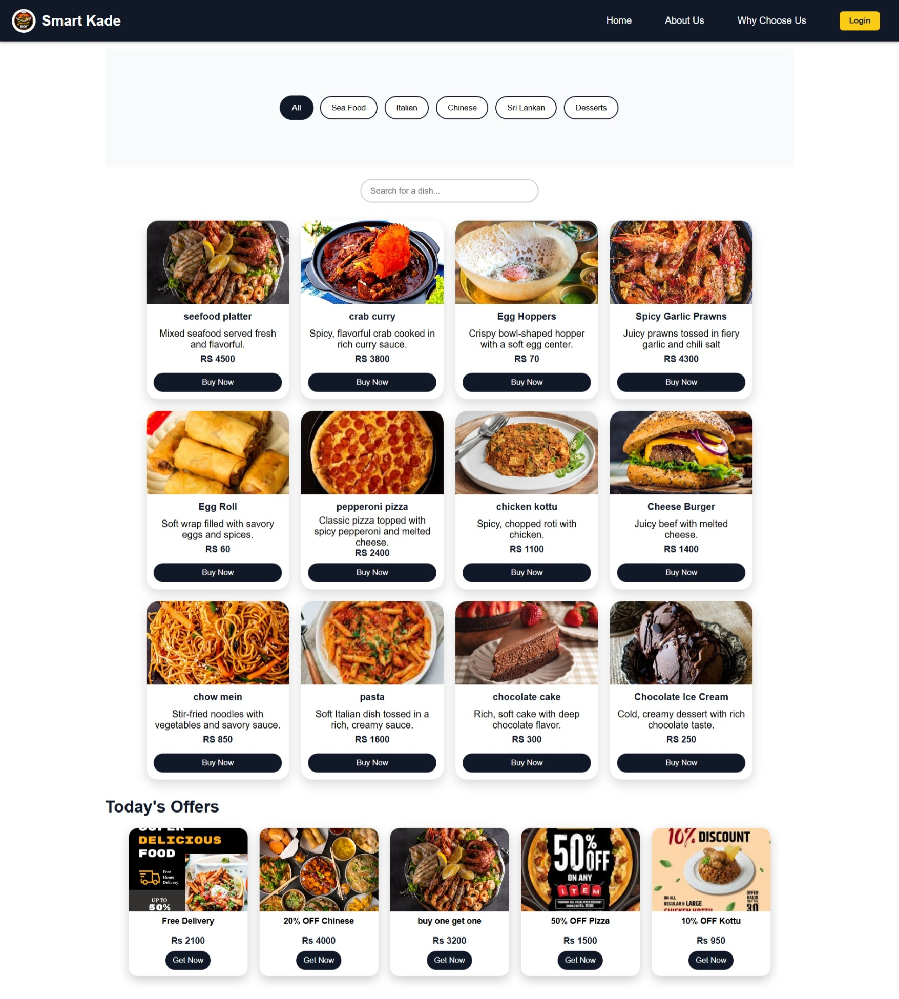 |
| Manage Items | 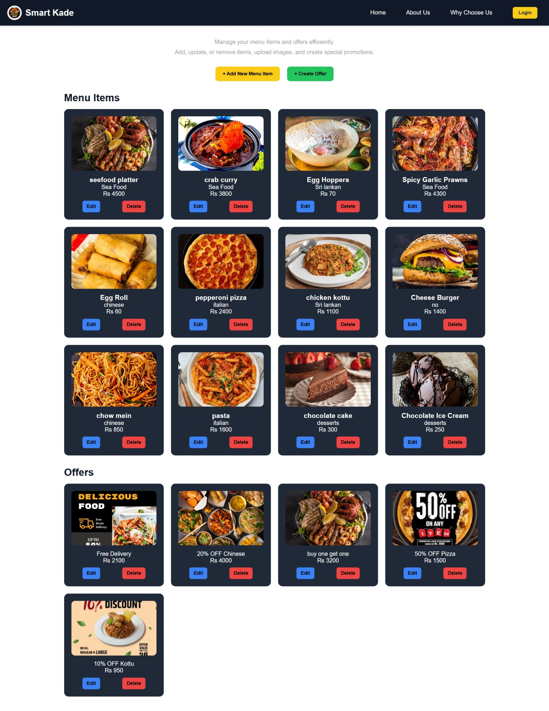 |
| Add Item | 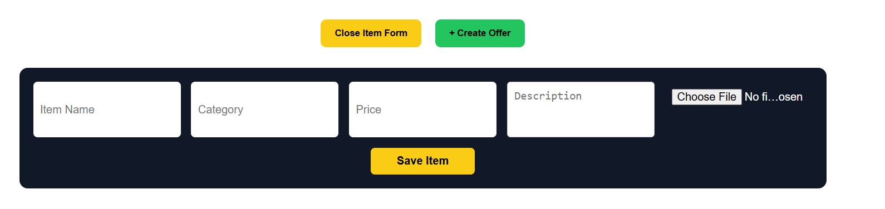 |
| Add Offer | 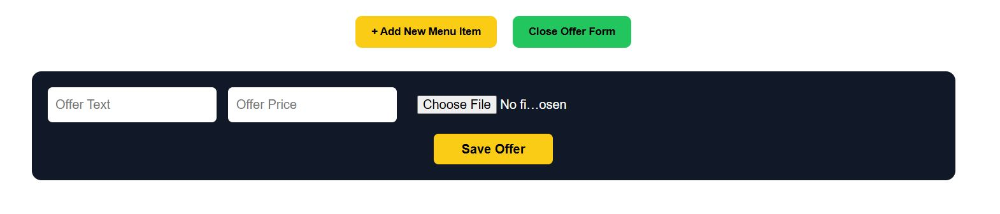 |
| Bill | 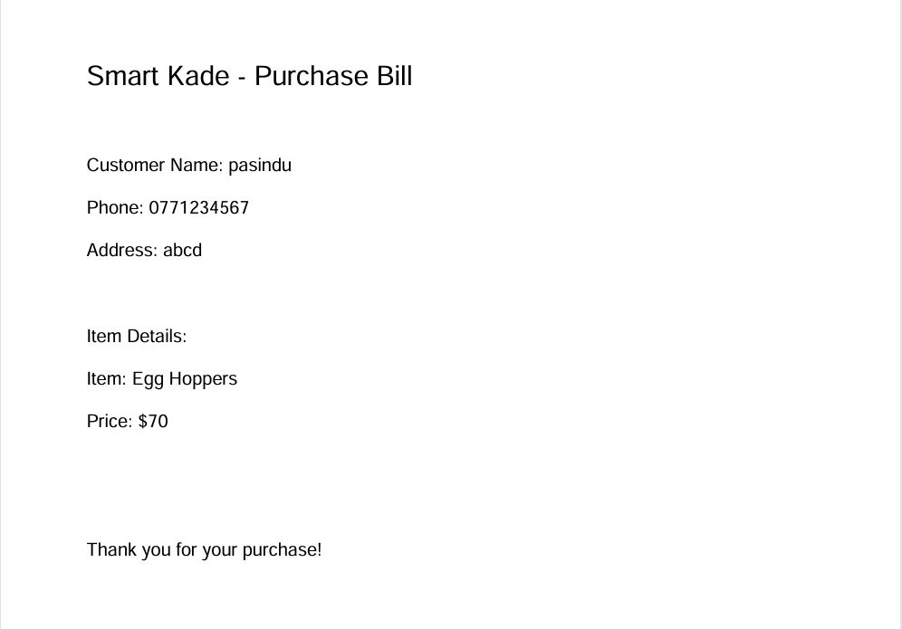 |

---

## Demo Credentials

### User
- Email: `pasindu@gmail.com`  
- Password: `123456`

### Admin
- Email: `admin@gmail.com`  
- Password: `123456`

---

## Setup Instructions

1. **Clone the repository**
```bash
git clone https://github.com/pasinduhimasha/Smart-Kade.git
cd smart_kade
Backend Setup

cd smart-kade-api
npm install
Make sure MongoDB is running locally

Configure .env if needed

Frontend Setup

cd smart-kade-frontend
npm install
npm run dev
Access the application

User frontend: http://localhost:5173

Admin panel: login with admin credentials

Author
Pasindu Himasha

License
This project is created for educational and portfolio purposes. You are free to explore, learn from, and improve the system.
